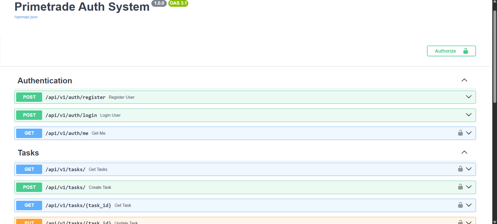
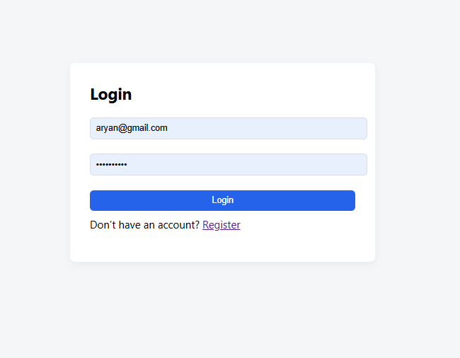
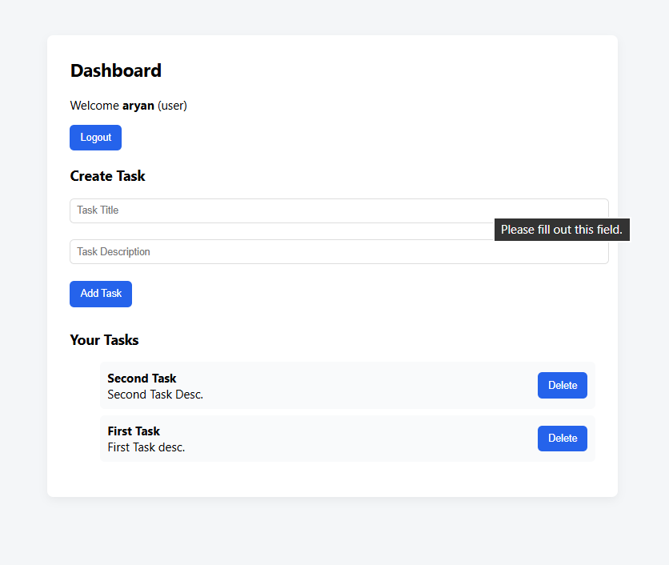

# 🚀 Primetrade Full-Stack Assignment

This full-stack system demonstrates secure backend architecture, clean API design, and scalable authentication patterns suitable for production environments.

This project implements a scalable authentication system and task management API with a connected React frontend.

---

## 📦 Tech Stack

### Backend
- FastAPI
- PostgreSQL
- SQLAlchemy
- JWT Authentication
- Role-Based Access Control
- Structured Error Handling
- Logging

### Frontend
- React (Vite)
- Axios
- React Router
- Protected Routes

---

## 🔐 Features Implemented

- User Registration
- User Login
- JWT Authentication
- Role-Based Access (Admin / User)
- Task CRUD (Ownership Enforced)
- Versioned API (`/api/v1`)
- Global Error Handling
- CORS Configuration
- Logging
- Persistent Login State
- Protected Frontend Routes

---

## 📸 Screenshots

### 🔹 API Documentation (Swagger)


### 🔹 Login Page


### 🔹 Dashboard



## 🏗 Architecture Highlights

- Modular backend structure
- Separation of models, schemas, routers
- Dependency injection
- Ownership-based resource protection
- Stateless JWT authentication (scalable)
- API versioning for extensibility

---

## 🚀 Running the Project

### Backend

```bash
cd backend
python -m venv venv
venv\Scripts\activate
pip install -r requirements.txt
uvicorn app.main:app --reload
```


### Frontend

```bash
cd frontend
npm install
npm run dev
```


---

## 📈 Scalability Notes

The architecture supports:

- Horizontal scaling (stateless JWT)
- Microservice separation (Auth / Task services)
- Redis caching (future)
- Docker containerization
- CI/CD integration

---

This project demonstrates secure authentication, role-based access control, and clean system architecture aligned with backend best practices.
